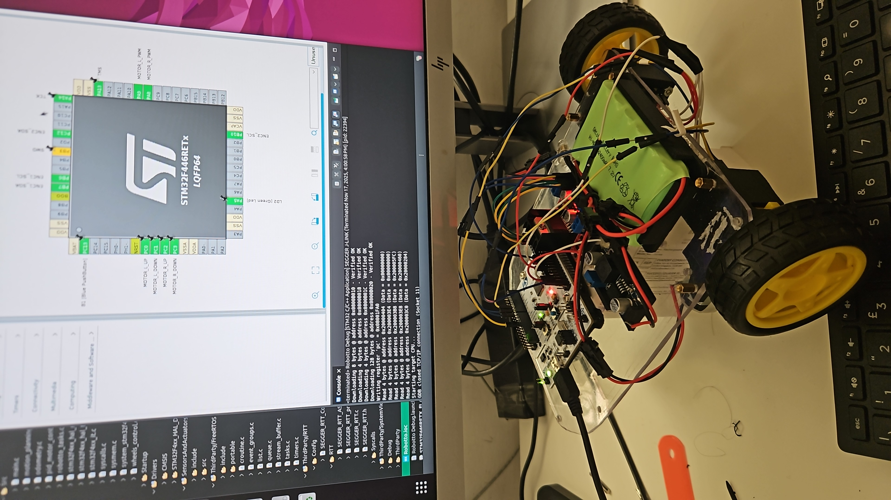
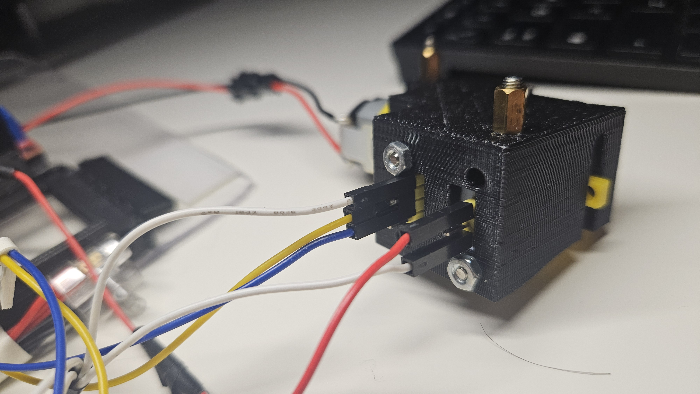
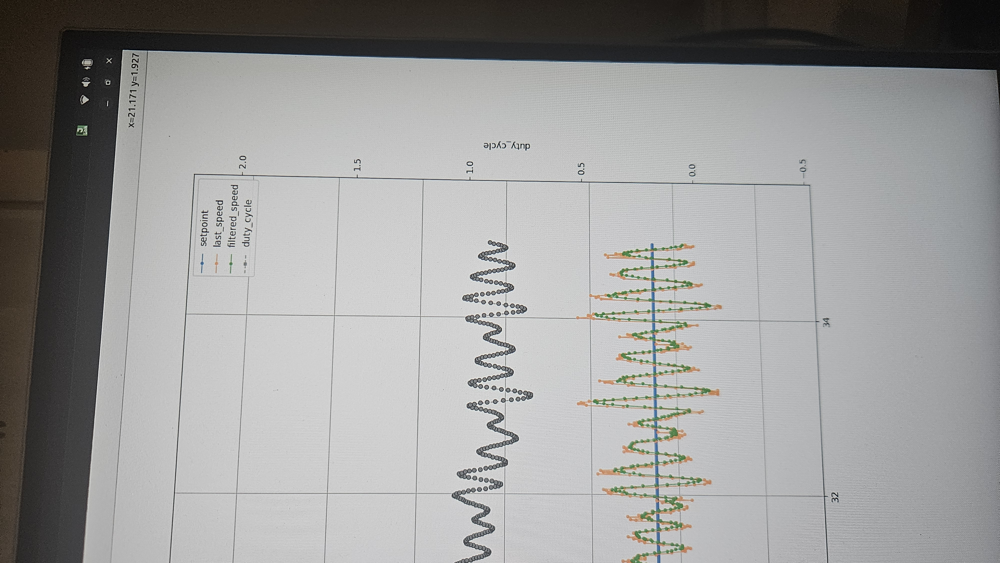
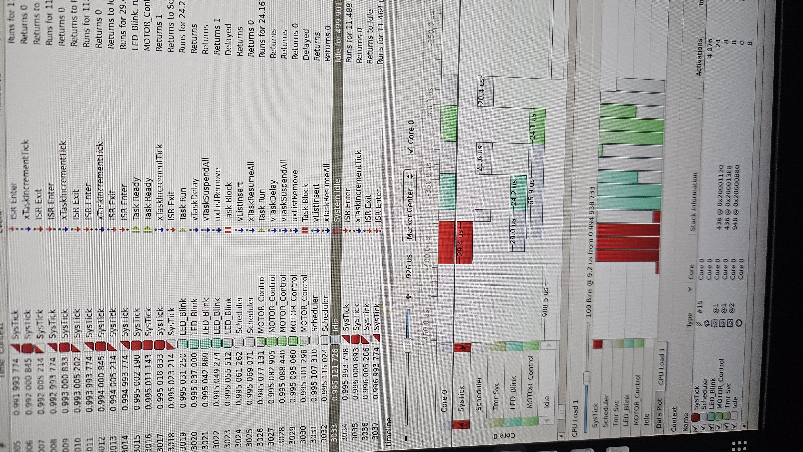
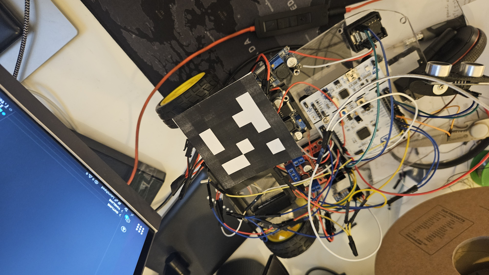
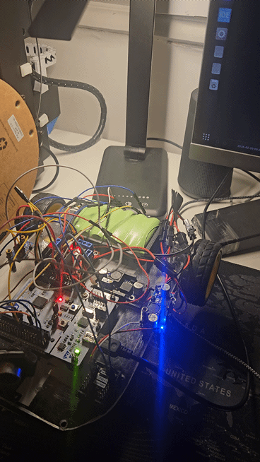

# RobOtto
RobOtto is an indoor differential-drive robot based on the STM32F446 (ARM Cortex-M4).

It is designed for education and experimentation across the full robotics stack:
- __hardware and electronic design__ (Fusion 360, power management, UART, I2C, PWM)
- __embedded software development__ and real-time system architecture (C, FreeRTOS, STM32 HAL)
- __controls and robotics algorithms__ (wheel speed control, sensor fusion, trajectory planning and tracking)
- __validation and tooling__ (MQTT-ROS2, OpenCV+ArUco, Foxglove)

The project favors inexpensive, common components with a focus on modularity and hardware abstraction.

## Project snapshots
These images provide a quick visual overview of the ongoing work.

<table>
	<tr>
		<td align="center" width="50%">
			<br>
			<sub>STM32CubeIDE board settings</sub>
		</td>
		<td align="center" width="50%">
			<br>
			<sub>3D printed motor support</sub>
		</td>
	</tr>
	<tr>
		<td align="center" width="50%">
			<br>
			<sub>Motor control loop testing</sub>
		</td>
		<td align="center" width="50%">
			<br>
			<sub>Segger SystemView trace</sub>
		</td>
	</tr>
	<tr>
		<td align="center" width="50%">
			<br>
			<sub>ArUco pattern detection</sub>
		</td>
		<td align="center" width="50%">
			<br>
			<sub>WiFi telemetry to Foxglove</sub>
		</td>
	</tr>
</table>

## Getting Started
### Clone the repository
```bash
git clone https://github.com/marcontex8/RobOtto.git ~/Robotto
```

### Build and flash the firmware
Use STM32CubeIDE for configuration, compilation, and flashing:
- Install [STM32CubeIDE](https://www.st.com/en/development-tools/stm32cubeide.html)
- Open the project from the repository root
- Build and flash via ST-Link

For runtime tracing, RobOtto integrates Segger RTT and SystemView. Install
[SystemView](https://www.segger.com/products/development-tools/systemview/) and connect via ST-Link
to capture logs in real time.

### Host tools
Host tools run on your workstation and depend on ROS2 and Python packages.
See HostTools/readme.md for setup and usage.

## Project Structure
This project has two main components: embedded firmware and host tools.

### Embedded firmware
- STM32CubeIDE configuration and settings (project root, Core)
- Third-party libraries (FreeRTOS, Segger RTT/SystemView) in ThirdParty
- Hardware/OS-specific modules (Communication, SensorsAndActuators, Tasks)
- Platform-independent logic and algorithms in Logic
- Unit tests for platform-independent code (Unity) in UnitTests

### Host tools
- Integration tests for ESP32 ↔ STM32 ↔ host communication
- Simulation scripts to validate theoretical algorithm behavior
- Validation tools that bridge telemetry to ROS2 and compare against camera-based pose detection


